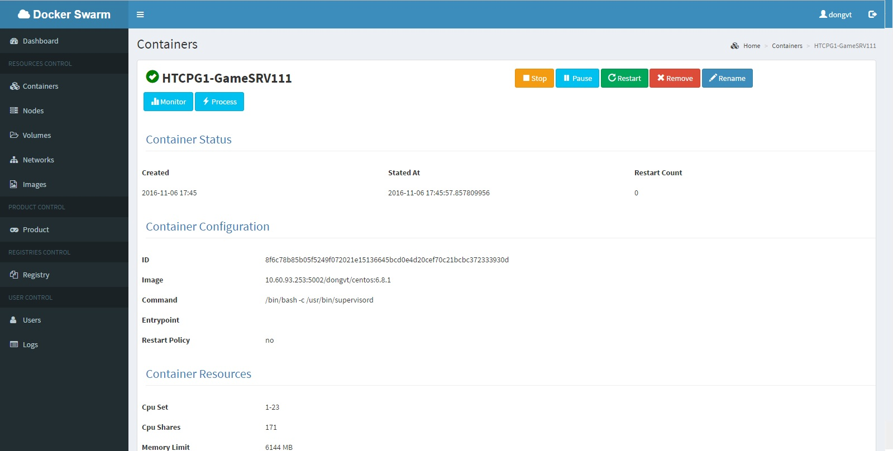

# Hướng dẫn sử dụng WEB để control swarm
TODO:

- Sau khi cài đặt xong web theo hướng dẫn trước tới bước này ta bắt đầu sử dụng swarm để tương tác với docker

---

## Usage

- Dashboard
- Containers
- Nodes
- Volumes
- Networks
- Images
- Product
- Registry
- Users
- Logs

---

#### Dashboard

#### Containers

#### Nodes

#### Volumes

#### Networks

