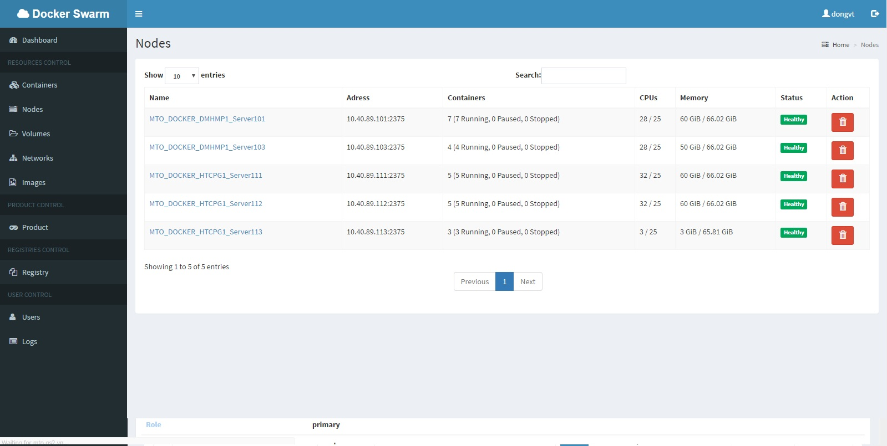
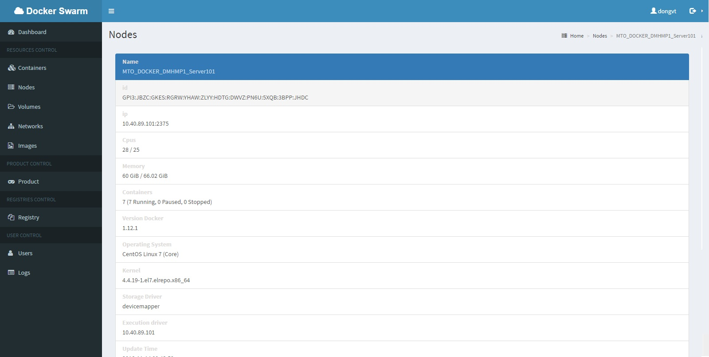
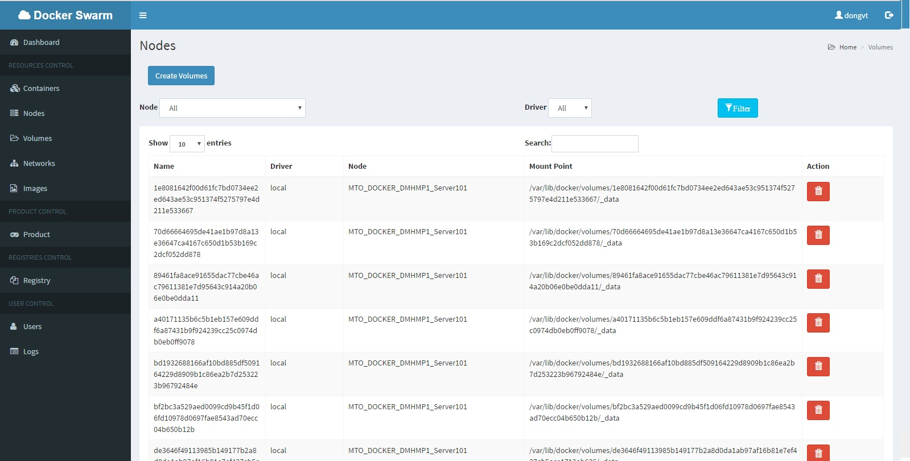
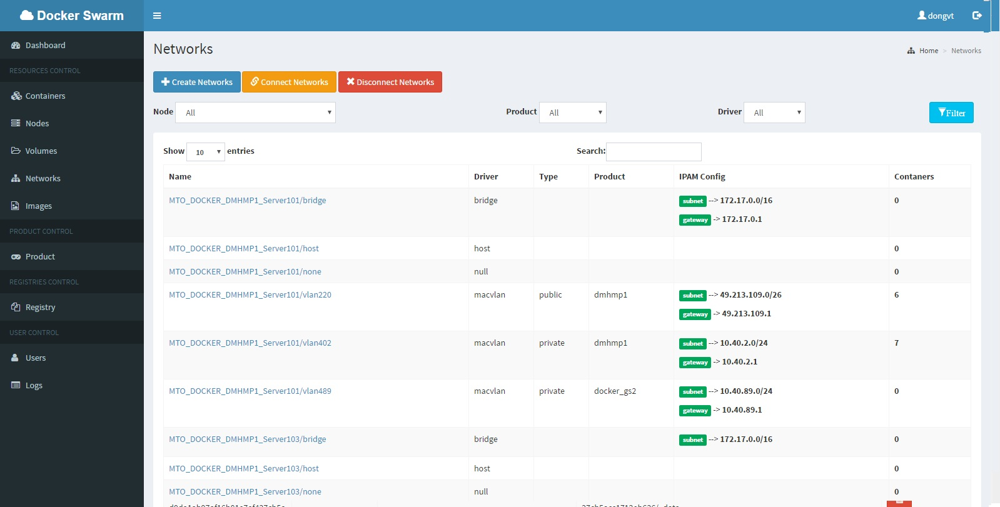
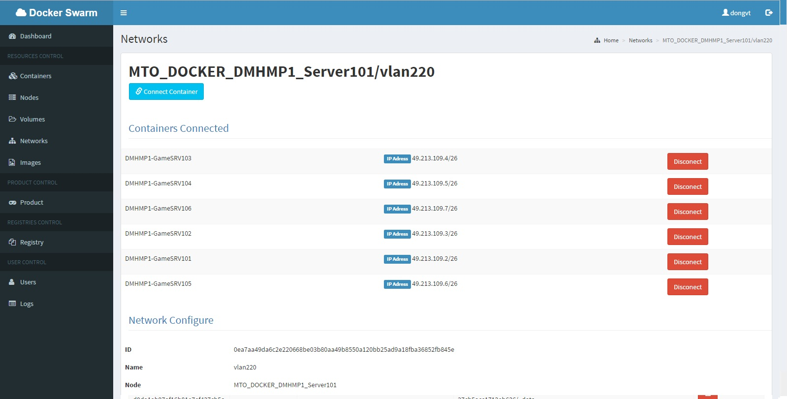

# Hướng dẫn sử dụng WEB để control swarm

TODO:

- Sau khi cài đặt xong web theo hướng dẫn trước tới bước này ta bắt đầu sử dụng swarm để tương tác với docker

---

## Usage

- Dashboard
- Containers
- Nodes
- Volumes
- Networks
- Images
- Product
- Registry
- Users
- Logs


---

#### Dashboard


#### Containers


#### Nodes




#### Volumes


#### Networks



Tool được viết khá lâu so với hiện tại, nên hiện nay sẽ không chạy được với các version mới do API docker swarm đã chỉnh sửa.
Tool có khá nhiều lỗi về security...

```
Phát triển thêm sẽ khá hay,
NOTED: nên sài kubernetes cho lành AHIHI 
```

Thích vậy ý kiến gì !!!!!!!!!!!!!!!

